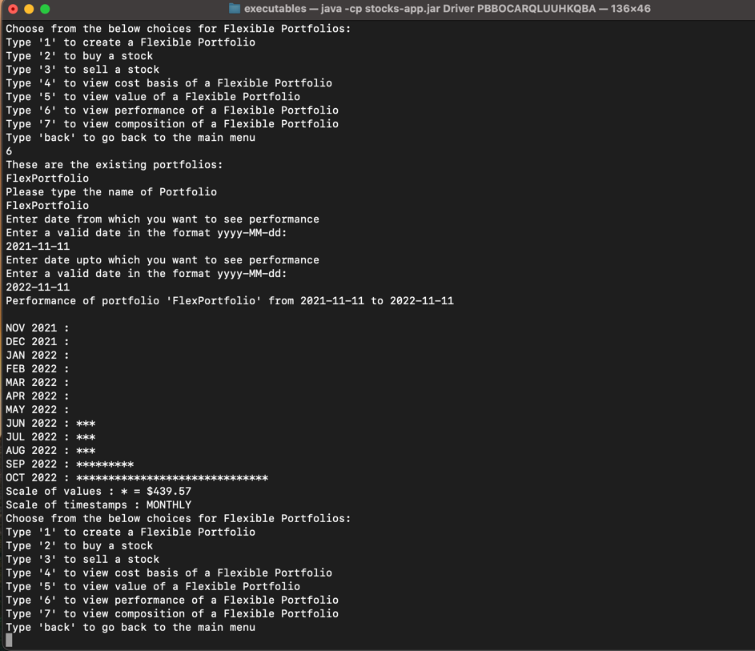
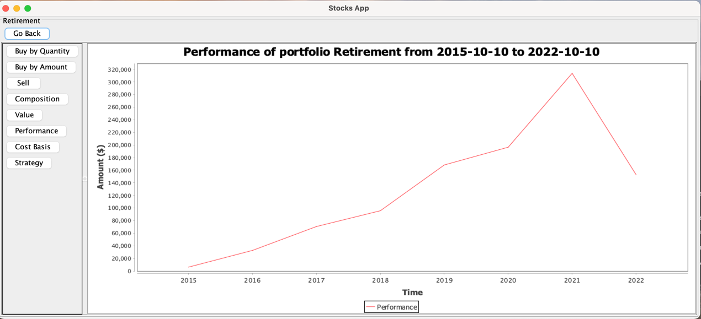
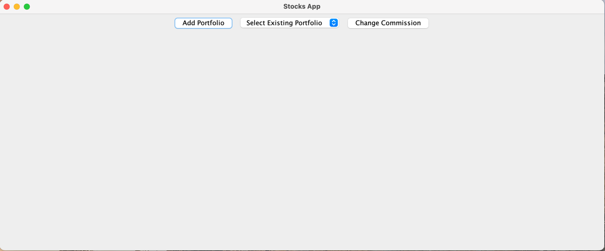
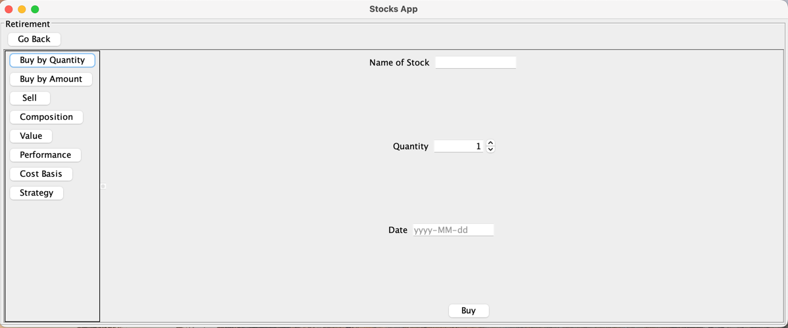

# Stocks-app

#### Description

Stocks-app is a text-based interactive application. The user of the application can be people who
are interested in investing in the stock market. This application can help them create `Portfolios`
of stocks, and let them view its composition and value on different dates.

#### This app has below features:

1. Allows user to create one or more inflexible/fixed portfolios with one or more stocks added to
   each. Portfolio can
   be created by following ways:
    1. Manually: By providing valid `ticker symbol` and `quantity` in the app
    2. Passing valid path of a `.csv` file
2. Allows user to view the composition of an inflexible portfolio ie; `Stock names` and
   their `quantities`
3. Allows user to view the individual values of each stock in an inflexible portfolio and total
   value of the
   portfolio by giving a `Portfolio name` that is present in the app currently
4. Portfolios created by the user are persisted into a `csv` file which can later be viewed on the
   file system easily
5. Allows user to create one or more flexible portfolios just by providing a name.
6. Once a portfolio is created, users are allowed to `buy` and `sell` stocks in a flexible
   portfolio. `NOTE:` App will prompt if user tries to sell grater number of stocks than they have
   bought. So, for an ideal experience users are suggested to do buy stocks before their sell.
7. In a flexible portfolio with stocks bought and sold, users are allowed to view the total money
   invested so far in the portfolio by a particular date by selecting the option to view cost basis
   of a flexible portfolio.
8. Allows user to view the composition of a flexible portfolio on a given date which is stocks
   and their quantities by that date.
9. Allows user to view the value of a flexible portfolio on a given date. If the stock market was
   not open on the asked date, then we show the value that was there when stock exchange was last
   open.
10. Allows user to view the performance of a flexible portfolio between two dates. They are shown in
    an appropriately scaled manner as a bar graph in the text-interface as
        GUI-interface as
     
11. Allows user to change the commission rate in the application accordingly charges will change
    when cost basis is asked
12. Allows user to buy a set of stocks by defining their proportions and placing a buy for the set
    of trades at once on a day. This is a way in which user can by by specifying an amount and
    according to the price on that day fractional share will be bought and added to the flexible
    portfolio
13. Allows user to create Dollar-cost averaging strategy that allows to invest a sum of money
    periodically like weekly or monthly in between a range of time. For example, you could create a
    strategy to invest $2000 every month starting from 2015-10-10 to 2022-10-10 in a flexible
    portfolio and add Stocks like GOOG and allocate 30% to it and MSFT and allocate 70% to it. This
    will perform trades on 10th of every month if market is open on that day else invests on next
    open day for stock exchange.
14. While creating a strategy, user may choose not to provide an end date for the strategy, and
    current behaviour of the application will make the trades till a day before today.

#### GUI features

1. Main menu of the GUI looks as   
    1. Allows user to create a flexible portfolio by asking for a name.
    2. User can change the commission fees
    3. User can choose to work with a portfolio by selecting a portfolio from the drop-down menu in
       the middle
2. Flexible Portfolio Menu options look as   
    1. Allows user to buy a stock by giving quantity, stock name and a date
    2. Allows user to buy a set of stocks by providing proportions of stocks and an amount of money
       to invest on a date
    3. Allows user to sell a quantity of stocks
    4. Allows user to view composition of a portfolio on a specific date
    5. Allows user to view the value of stocks in a portfolio on a given day whichever are bought
       till that date are included
    6. Allows user to view the performance of a portfolio between a start and an end date that will
       show a line chart for that period and line represents values of portfolio over the period.
    7. Allows user to view the amount of money invested in the portfolio by a particular date that
       also includes the commission fees charged per transaction.
    8. Allows user to invest a sum of money into the portfolio as a Strategy over a period of time
       for a set of stocks and determining the allocation to those on a given range of dates.

#### Limitations

1. App will crash if `resources` folder along with its contents is not provided alongside the jar in
   the location, as it contains initial required files to start the application
2. App supports creating portfolios with `ticker symbols` that are present in data obtained from
   this API. Meaning if data for that stock is not available in the API then App does not support
   that symbol.  
   Source: https://www.alphavantage.co/documentation/
3. App supports viewing performance for daily, weekly and monthly values of flexible portfolio.
3. Performance of portfolio can be viewed for dates having difference between from and to dates
   where any date must not be before 1995.
4. App does not support fractional quantity of shares to be provided by the user directly
5. Once an inflexible portfolio is created, it cannot be updated or removed
6. App does not allow to create a portfolio with `<blank>` name
7. App does not allow to create an inflexible portfolio without stock details like `ticker`
   and `quantity`
   provided
8. App may not work properly if Alphavantage API is not working or API KEY provided while starting
   the application is incorrect.

#### External Libraries

1. We used `JFreeChart` to show performance on GUI. Terms of which allow us to use it for open
   source projects that can be found here: https://www.jfree.org/jfreechart/

#### Design Doc

[DESIGN_README.md](res/DESIGN_README.md)

#### SetUp Doc

[SetUp_README.md](res/SETUP_README.md)
